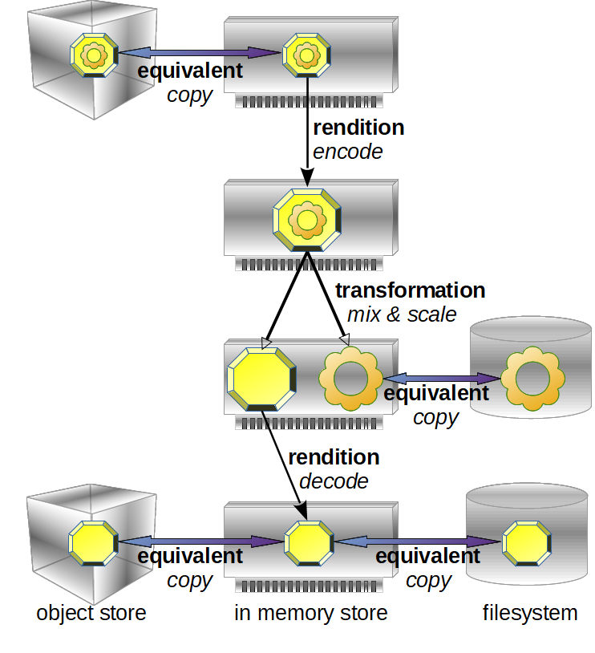

# Aerostat Beam Engine

[Redis](https://redis.io/)-backed highly-scale-able and cloud-fit distributed media processing engine. A [Node.js](https://nodejs.org/en/) web application and library, _Aerostat Beam Engine_ provides the following:

* A resilient, media-aware cache of media data structured ready for processing by [FFmpeg](http://ffmpeg.org/) libraries, which can be backed by file or object stores;
* Connection to stateless clients that provide access to the media-aware cache through the _Content Beam API_, an HTTP/S API for transporting media data, pushed and pulled, compressed or uncompressed;
* Job queues allowing multiple worker clients to carry out media transformations _just-in-time_ or _just-in-case_, executing on either the local system, distributed across many systems, GPU accelerated or via serverless compute services like [AWS Lambda](https://aws.amazon.com/lambda/).

The engine is a web server application that provides access to read and write data stored in the underlying Redis cache, which may be a single Redis instance or a cluster of master/slave Redis instances. Also included are some example workers, a library to build customised workders and the ability to trigger work based on rules.

This is an implementation of the core of the [Agile Media Blueprint](https://www.streampunk.media/agile-media-blueprint).

Work in progress. For Node.js FFmpeg native bindings, please see [Aerostat Beam Coder](https://github.com/Streampunk/beamcoder).

## Installation

Before installation can take place, it is necessary to identify some connected networked resources, to include:

* system(s)/container(s)/VM(s) to run the [Node.js](https://nodejs.org/en/) Beam Engine web apps, possibly behind a load balancer such as [NGINX](https://www.nginx.com/) or [AWS Elastic Load Balancing](https://aws.amazon.com/elasticloadbalancing/).
* system(s)/container(s)/VM(s) to run [Redis](https://redis.io/), either a single instance, replicated or as a cluster. Alternatively, use a Redis-backed cache service such as [AWS Elasticache](https://aws.amazon.com/elasticache/) or [Azure Cache for Redis](https://azure.microsoft.com/en-gb/services/cache/).
* system(s)/container(s)/VM(s) to run workers written in Node.js, some of which may need access to a shared file system to persist cached data.
* access to serverless processing capability such as [AWS Lambda](https://aws.amazon.com/lambda/) or [Azure Functions](https://azure.microsoft.com/en-gb/services/functions/) (optional).
* systems with GPUs for workers that can do accelerated GPU processing (optional).

It is recommended that for the distributed processing of uncompressed HD video data, all network interconnects run at speeds at or over 10Gbs.

For development purposes, it is possible to run Redis, Beam Engine and workers all on the same system.

### Node.js prerequisites

On x86_64 Windows, Mac or Linux platforms, Beam Engine uses the latest Long Term Support version of Node.js which is currently the most recent v10. Download or install Node.js from [here](https://nodejs.org/en/) or use a [system package manager](https://nodejs.org/en/download/package-manager/).

The Aerostat Beam Engine web app and workers depend on [Aerostat Beam Coder](https://github.com/Streampunk/beamcoder), a module that is a native addon that requires compilation as part of its installation process. The Node.js native addon build tool is called `node-gyp`. Follow the [node-gyp installation instructions](https://github.com/nodejs/node-gyp#installation) to ensure that each Node.js system is ready to build native extensions.

Note: For MacOSX Mojave, install the following package after `xcode-select --install`:

    /Library/Developer/CommandLineTools/Packages/macOS_SDK_headers_for_macOS_10.14.pkg

The Beam Coder installer downloads suitable FFmpeg `.dll`s on Windows and uses _homebrew_ to install FFmpeg `.dylib` libraries on Mac. For Linux, install FFmpeg development packages suitable for your Linux version, ensuring that the packages include the shared library `.so` files.   

### Redis

For local working, install Redis on a system or systems with a substantial amount of memory. Follow the instructions from Redis themselves. For testing and low criticality systems, a single Redis instance or replicating instance may be sufficient.

For mission critical applications, consider establishing a cluster. Beam Engine uses [ioredis], a package with support for single connections as well as self-healing connections to members of a Redis cluster.

For cloud environments, consider using Redis backed cache service, creating a connection to a virtual private network where the beam engines and workers are located. Such services include:

* aws
* MS
* Google

For development and testing on Windows, consider installing Redis using the [Windows Subsystem for Linux](). Note that for some operations, this approach is one or two orders of magnitude slower than installing Redis on a Linux build directly and, as such, should only be used for feature testing and not performance testing.

### Development

To run a Beam Engine in development mode, clone the module from github. In the modules root folder, edit the `config.json` file to match local settings. Then run `npm install` followed by `npm run dev`. This will install dependencies and start the development web server that runs using the automated restart module [nodemon](). To restart, type `rs`.

To see debug information from Redis connections (ioredis), the web framework (Koa 2) and from the job queues (Bull), set the debug flag as follows.

From bash:
```
$ DEBUG="*,-not_this"; npm run dev
```

From Windows Powershell:
```
PS > $env:DEBUG="*,-not_this"; npm run dev
```

To create workers, install Beam Engine in your project.

    npm install beamengine

### Production

__TODO__ - to follow.

## Configuration

Configuration of an Aerostat Beam Engine is achieved by editing the `config.json` file. This can also be passed in on the command line as follows:

__TODO__ config on the command line

## Content Beam API

The _content beam API_ allows FFmpeg-like media data structures to be transported over [HTTP](https://en.wikipedia.org/wiki/Hypertext_Transfer_Protocol) and [HTTPS](https://en.wikipedia.org/wiki/HTTPS) protocols. This allows streams of related media - a _virtual format_ or _logical cable_ - to be moved around for processing, storage or presentation, either streamed in order or worked on in parallel. Assuming backing by a cache, live streams can be stored and retrieved with minimal delay - recorded and played back - with a mechanism to start streaming at the latest frame. As _content beams_, API endpoints can both host the content they represent through a pull-based mechanism and/or push media to other endpoints.

All content beam API requests start with `/beams/`. The content beam API for HTTP/S breaks down as:

`/beams/`&langle;_content_name_&rangle;`/`&langle;_stream_name_&rangle;`/`&langle;_media_ref_&rangle;`/`&langle;_data_ref_&rangle;

* _content_name_: a reference to the source of the content and is set be default to the `url` property of the underlying format context (encoded to safe representation for use in the path part of a URL). This is a unique name for the content that can be beamed from this endpoint.
* _stream_name_: Content is subdivided into streams of _video_, _audio_, _captions_/_subtitles_ and _data_. Streams can be referenced by their index and/or type, e.g. `stream_0`, `stream_1`, ... or aliases `video`, `audio`, `subtitle`, `data` or `attachment` ... or aliases for the first audio stream `audio_0`, the second `audio_1` ... or alias `default` for the stream that FFmpeg considers to be the default stream.
* _media_ref_: The _presentation timestamp_ that uniquely represents a specific media element - _frame_ or _packet_ - or range of media elements in a stream. Most streams have a _time base_ that the presentation time stamps of each element, frame or packet, are measured. Without a _data_ref_, this refers to metadata only.
* _data_ref_: Access to data payloads associated with a single media element, usually simply `data`. For planar data used in some frame formats, `data` refers to the planes concatenated and `data_0`, `data_1` ... refer to each plane.

Content can be created, pulled and pushed, streamed, written, read and deleted using this API. A few examples follow and then the rest of this section breaks down the API in further detail.

To read a single video frame from a compressed stream at timestamp `108000` in content called `newswatch_20190312` for a stream with a time base of 90,000Hz, two GET requests are required:

    https://production.news.zbc.tv/beams/newswatch_20190312/video/108000
    https://production.news.zbc.tv/beams/newswatch_20190312/video/108000/data

The first retrieves the metadata and the second retrieves the associated payload. Here is an example of the retrieved metadata, a JSON document:

```json
{
  "type": "Packet",
  "pts": 108000,
  "dts": 108000,
  "size": 16383,
  "stream_index": 0,
  "flags": {
    "KEY": true,
    "CORRUPT": false,
    "DISCARD": false,
    "TRUSTED": false,
    "DISPOSABLE": false
  },
  "duration": 3600,
  "pos": 18430875
}
```

The second _data_ URL retrieves a payload of type `application/octet-stream` with content length `16383`.

The packet metadata contains no details as to the relative timing of the media element wrt other elements of the stream, the type of data payload or the encoding used. To be able to decode that packet, it is necessary to find out the details of the associated stream. This can be retrieved from a GET request to one of following URLs:

    https://production.news.zbc.tv/beams/newswatch_20190312/video
    https://production.news.zbc.tv/beams/newswatch_20190312/stream_0
    https://production.news.zbc.tv/beams/newswatch_20190312/stream_0.json

The URLs are equivalent and produce the following response:

```json
{
  "type": "Stream",
  "index": 0,
  "id": 301,
  "time_base": [ 1, 9000 ],
  "start_time": 7200,
  "duration": 53666250,
  "r_frame_rate": [ 25, 1 ],
  "codecpar": {
    "type": "CodecParameters",
    "codec_type": "video",
    "codec_id": 173,
    "name": "hevc",
    "format": "yuv420p",
    "width": 1920,
    "height": 1080,
    "color_range": "tv"
  }
}
```

Time can be specified by timestamp, index count, in real time and relatively by offset, including to the _first_ and _latest_ - or _last_ - media elements. Metadata can be retrieved using time ranges. Timestamp specification can be _fuzzy_ for the case where errors in timestamp digitisation, fractional framerates or stream jitter mean that timestamps do not increment by an exact, constant value. Here are some examples:

* Single data packet: `/beams/newswatch_20190312/video/packet_108000`
* Uncompressed frame: `/beams/newswatch_live/video/frame_108000`
* Fuzzy match: `/beams/newswatch_live/video/107950f` - also finds 108000
* Range of timestamps: `/beams/newswatch_live/video/108000-144000` (inclusive)
* Range of indexes: `/beams/newswatch_live/video/751st-760th` (1-based from 1st)
* Time range: `/beams/newswatch_live/video/30s-31s` - relative to time base
* To the end: `/beams/newswatch_live/video/1080th-last`
* First frame: `/beams/newswatch_live/video/first`
* Latest frame: `/beams/newswatch_live/video/latest` - redirect to most recent

Finally, these URLs may be decorated by job specifications, such as converting any referenced video frame to a JPEG:

     /beams/newswatch_live/video/frame_108000.jpeg

Another example is creating a partial MP4 file for a specified frame range for all streams:

    /beams/newswatch_live/all/30s-45s.mp4

### Listing available content

The names of all the items of content items stored at an endpoint can be retrieved by a GET request to `/beams/`. This may be a long list and so the request supports query parameters `start` offset and `limit` to enable paging of the values. The value returned is a JSON ay

__TODO__ - example

It is assumed that an external search service, such as [Elasticsearch](), will be used to provide a better searchable index of available streams.

### Format - the logical cable

Content items have a _format_ that provides the context for reproducing that content. This consists of overall description, the streams that make up the content and the technical parameters to configure decoders. When used to access files, the beam API format is a representation of labels of the storage compartments of that container. When used to access a live stream, the _format_ can be considered as if the description of a multi-core _cable_, where each strand of that cable contains the latest content for a particular stream. As media elements in beams are only tied together by URL, beams of the beam API represent _virtual formats_ and _logical cables_.

Each content item has a format that is used to create, query, update or delete that content from a beam engine. All requests take the form `/beams/`&langle;_content_name_&rangle;.

To get the details of a format associated with a content item, a JSON document, send a GET request including the content name. For example, one of:

    https://production.news.zbc.tv/beams/newswatch_20190312
    https://production.news.zbc.tv/beams/newswatch_20190312.json

This will produce a result of the form:

```json
{
  "type": "format",
  "streams": [
    {
      "type": "Stream",
      "index": 0,
      "time_base": [ 1, 90000 ],
      "codecpar": {
        "type": "CodecParameters",
        "codec_type": "video",
        "name": "hevc",
        "format": "yuv420p",
        "width": 1920,
        "height": 1080
      }
    },
    {
      "type": "Stream",
      "index": 1,
      "time_base": [ 1, 90000 ],
      "codecpar": {
        "type": "CodecParameters",
        "codec_type": "audio",
        "name": "aac",
        "format": "fltp",
        "bit_rate": 66494,
        "channel_layout": "stereo",
        "channels": 2,
        "sample_rate": 44100,
        "frame_size": 1024
      }
    }
  ],
  "url": "newswatch_20190312",
  "duration": 596291667,
  "bit_rate": 2176799,
  "metadata": {
    "title": "ZBC News Watch - evening news 12th March 2019",
    "author": "ZBC News Production"
  }
}
```

Note that the name of the content item is stored in the `url` property. Consider using ECMAScript function [`encodeURIComponent`]() when using the name in a path. Also note that if the `format` has in input format set (`iformat` property), the result will have type `demuxer`. Similarly, if the format has an output format set (`oformat` property) it will have type `muxer`.

To create a content item, POST a JSON format description to `/beams/`. The content item's name will be set using the `url` property if present, otherwise a [version 4 UUID](https://en.wikipedia.org/wiki/Universally_unique_identifier) will be generated. If the content item already exists, a `409 - Conflict` error response will be generated. If the content item is successfully created, a `201 - Created` response is returned with the `Location` header set to the path for the new item.

The following code shows how to create a content items from an Aerostat Beam Coder format using the [got](https://www.npmjs.com/package/got) promise-friendly HTTP request module:

```javascript
let response = await got.post(
    'https://production.news.zbc.tv/beams/',
  {
    body: wavFmt.toJSON(),
    json: true,
    headers : { 'Content-Type': 'application/json' }
  }
).catch(err => {
  if (err.statusCode === 409) {
    console.log('Got conflict: assuming OK.');
  } else {
    throw err;
  }
});
```

__TODO__ - updating a format - not yet supported
__TODO__ - deleting a format - not yet supported

### Streams

Streams are the sub-components of a format, the virtual strands of a logical cable. The details of streams are provided as part of the format but can also be accessed stream-by-stream using index or stream type. Streams are located within their content item at a sub-path:

`/beams/`&lrangle;_content_name_&rangle;`/`&lrangle;_stream_name_&rangle;

The primary _stream_name_ is based on the stream index, made by appending the index to `stream_`, e.g. `stream_0`, `stream_42`. This can be shortened to just the index number, e.g. `0`, `42`.

Streams define a `time_base` for the unit of measurement for any of the media elements of the stream. Any two streams in the same format may have a different time bases but any timestamp measured to have the same time value relative to the time base should be presented at the same moment to the viewer. For example, for a video and audio time element:

* Video stream time base is `[1, 90000]` and the frame's presentation timestamp is `90000` then the video frame must be presented at 1s.
* Audio stream time base is `[1, 48000]` and the audio frame's presentation timestamp is `48000` then the audio samples must be played at 1s, co-timed with the video frame.

Streams have codec parameters defining the way data is encoded (or not) and the dimensions of each media element, including pixel format, sample format, resolution, colorspace etc.. The codec has a name and a type, with the type describing whether the stream consists of _video_, _audio_, _subtitles_ (_captions_), _data_ or an _attachment_. The difference between a _data_ stream and an _attachment_ stream is that a data stream contains elements of timed data associated with the video, such as interactive event triggers, whereas an _attachment_ is a single item of data for the entire stream, such as a thumbnail image.

To make it easier to make reference a stream, the codec type can be used as the name of a stream in the URL. If more than one stream of a particular type exists, a type-scoped index can be added, with e.g. `audio` and `audio_0` referencing the first audio stream, `audio_2` the second and so on. This is an alias ... the primary _stream_name_ is always based on the stream index.

A final alias, `default`, is a reference to the stream that FFmpeg nominates as the default for a format. This is normally the main video track and provides a time base for making reference to all the streams of a format.

Details about a stream can be retrieved in the form of a JSON document with a GET request. The following four requests are equivalent (`.json` extension is optional):

    https://production.news.zbc.tv/beams/newswatch_2019031/stream_0
    https://production.news.zbc.tv/beams/newswatch_2019031/video.json
    https://production.news.zbc.tv/beams/newswatch_2019031/viddo_0
    https://production.news.zbc.tv/beams/newswatch_2019031/default

The result is the same as the stream returned as part of the parent format:

```json
{
  "type": "Stream",
  "index": 0,
  "time_base": [ 1, 90000 ],
  "codecpar": {
    "type": "CodecParameters",
    "codec_type": "video",
    "name": "hevc",
    "format": "yuv420p",
    "width": 1920,
    "height": 1080
  }
}
```

__TODO__ - add a stream to a format.
__TODO__ - updating details of a stream.

### Media elements - metadata

The sub-components of a stream of media are its _media elements_, a generic term referring to either a _packet_ of encoded data or an uncompressed _frame_ of media. A frame is either a single video frame or a sequential grouping of audio samples, where the size of the group is related to either the video frame timing (e.g. 1920 samples for every video frame at 25fps) or by the _blocksize_ for a given audio codec (e.g. AAC uses a blocksize of either 960 or 1024 samples). Media elements are located in time within a stream at a given _presentation timestamp_ (PTS) and the PTS is the primary identifier for a media element.

A beam engine stores data about every media element, its _metadata_, and may also store the payload of the media element. For packets, this is a sparse amount of data including the presentation timestamp, decode timestamp (e.g. for streams of H.264 video where the stored decode order and presentation order differ), duration and position in the source stream. For frames, additional details of the format, resolution, sample rate etc. are included.

Media element metadata can be read and queried with GET requests and written with PUT requests. The URL is the same as for a stream, including name aliasing, with a media reference specifying the specific media element or elements.

`/beams/`&lrangle;_content_name_&rangle;`/`&lrangle;_stream_name_&rangle;`/`&lrangle;_media_ref_&rangle;

GET requests can be for either a single media element or an inclusive range of media elements whereas PUT requests are for a single element only. The body of requests and responses are `application/json`. Five kinds of request can be made with a _media_ref_:

* _direct by timestamp_: GET and PUT. Retrieve, create or update metadata about a specific packet or frame, using a direct media reference of the form `packet_`&langle;pts&rangle; or `frame_`&langle;pts&rangle;. Direct requests bypass index lookup but require that the PTS value in the path is exact.
* _presentation timestamp_: GET only. Request contains a presentations timestamp or range of presentation timestamps, e.g. `7200` or `7200-43200`. Add an `f` for fuzzy match, useful when sampling errors, jitter or sampling conversion may cause timestamps to be non exact, e.g. `7200f` will match the closest media element to 7200, either before or after.
* _index_: GET only. Request contains a media element that is a given count into the stream in its current state, from the `first` to the `last` element. For example, `first` or `1st`, `2nd`, `3rd`, ... up to e.g. `41st`, `42nd` or `last`. Ranges can be used, such as `first-last` for all media elements or `345th-723rd`. Index values are 1-based.
* _real timestamps_: GET only. Request contains a real time value or range measured in seconds, with the beam engine converting presentation timestamps to real time based on the stream time base. For example, `1.4s` resolves to frame `35` in a stream with a time base of 25fps and `1.2s-2.2s` refers to frames `30-55`.
* _relative timestamp_: GET only. Retrieve a media element at a given offset before or after the specified presentation timestamp. If following a live stream, this allows a request to be made for the next frame. For scrubbing, this allows jumping backwards and or forwards from a given point. The format is the PTS `+`/`-` offset signified with `d`, e.g. `7200+1d` references the frame after one with timestamp `7200`, say `10800`, and `7200-1d` is the frame before, say `3600`.

The query can have query parameters `offset` and `limit` to control how many values are returned and the pagination of values. GET requests return JSON arrays, even for a single value, or `404 - Not Found` if no results are found. All requests can have `.json` as an optional file extension.

Here is an example of a relative timestamp request.

    https://production.news.zbc.tv/beams/newswatch_2019031/stream_1/3600+1d

```json
[ { "type": "Packet",
    "pts": 7200,
    "dts": 7200,
    "stream_index": 1,
    "flags": {
      "KEY": true,
      "CORRUPT": false,
      "DISCARD": false,
      "TRUSTED": true,
      "DISPOSABLE": false
    },
    "duration": 3600,
    "pos": 81912,
    "buf_size": 16383
  } ]
```

Streams of type _attachment_ have a single media element _packet_ with a presentation timestamp of zero.

When creating or updating packets created by Aerostat Beam Coder, use the `toJSON` method. Assuming a packet called `pkt` is in the local scope, the following example shows how to create a packet using the [got](https://www.npmjs.com/package/got) promise-friendly HTTP request module:

```javascript
await got.put(
    `https://production.news.zbc.tv/beams/newswatch_2019031/stream_1/packet_${pkt.pts}`,
  {
    body: pkt.toJSON(),
    json: true
  }
);
```

__TODO__ - check updating of media element data
__TODO__ - delete media elements - is this necessary or only when deleting owning format?

### Payload data

Payload data for a media element is stored separately from the metadata that describes it and may have a different lifetime in the cache. It is possible to be able to retrieve the metadata but not get access to the payload because it has expired. See details on creating relationships and workers that can mitigate against the issue.

Payload data has the same basic path as the associated media element's _direct by timestamp_ path with an extension of `.raw` or sub-path part `.../data`. The additional part is the _data_ref_. It is only possible to reference one media element, frame or packet, at a time:

* For packets, this is a reference to the single _blob_ of data contained in a packet.
* For frames that often contain more than one _blob_, e.g. three planes of data with one for each colour component, an unqualified data reference refers to all the _blobs_ concatenated together. Reference can be made to each separate plane by adding an zero-based index, e.g. `.raw_0` or `/data_0` for the first plane, `.raw_1` or `/data_1` for the second, and so on.

In the following example of retrieving the data payload for a specific frame, the data for each plane for a format of `yuv422p` is retrieved separately, possibly concurrently:

    https://production.news.zbc.tv/beams/newswatch_2019031/stream_1/frame_7200/data_0
    https://production.news.zbc.tv/beams/newswatch_2019031/stream_1/frame_7200/data_1
    https://production.news.zbc.tv/beams/newswatch_2019031/stream_1/frame_7200/data_2

Alternatively, the data for all the planes can be retrieved as follows:

    https://production.news.zbc.tv/beams/newswatch_2019031/stream_1/frame_7200/data

The value returned contains a header `Beam-Buf-Sizes`, a JSON array with the size of each separate data plane. For example:

    Beam-Buf-Sizes: [ 2073664, 1036864, 1036864 ]

Note that due to the way FFmpeg code reads buffers, the size of each data plane buffer is generally slightly larger than the minimum required to represent a plane of data.

An equivalent request using the `.raw` extension:

    https://production.news.zbc.tv/beams/newswatch_2019031/stream_1/frame_7200.raw

All payload data has content type `application/octet-stream` even if the payload may have another valid MIME type, such as the payloads produced by the `png` codec could have MIME type `image/png`. 

## Relationships

Items of content may be related to other items because they are:

* byte-for-byte _equivalent_, stored in different locations but otherwise with exactly the same encoding, format and other metadata;
* visually equivalent _renditions_, such as some source material and all of the encodings made from it, generally with the same resolution;
* _transformations_ that create a new item of content by applying a filter such as scaling or mixing, possibly with one or more inputs.



These kinds of relationships can be stored in the beamengine to allow a worker to select the most appropriate format or location from which to retrieve source data and/or deliver a result.

### Equivalent

Beam Engine uses Redis as a RAM cache for media data but this cannot be a permanent, medium or long term storage medium. The time-to-live from creation to cache expiry for media data payloads can be set in the config file. When data payloads expire, they are no longer available unless they have also been stored in an external equivalent content item. An equivalent content item is a byte-for-byte copy of the source data. Typically, an equivalent content item will have content name that represents a resolvable storage reference, such as a local file path of AWS S3 bucket identifier, where a version of the cached content was persisted by a worker.

Equivalent content representations are one-to-one relationships. Although there will often be a content source, any equivalent content item should be able to be substituted by another.

Here is an example workflow for a content item being recorded via the Beam Content API.

1. A new content item is created. A file backup worker with access to a shred storage drive responds to all content creation requests by creating an equivalent content items with the same format and streams. An equivalent content relationship is stored in the Beam Engine.

2. Each packet that is stored into the Beam Engine creates a post-response job that stores the packet's metadata and payload onto the shared storage.

3. Requests for the packet's payload that take place prior to the expiry of the packet in the cache are services from the cache.

4. Requests for the packet's payload that occur after the cache expiry cause a `404` error that is intercepted and creates a job. A worker checks to see if any equivalent off-line items of content exists. If so, the packet is retrieved from that storage. By policy, the packet's payload can be re-created in Redis if further requests are expected within the TTL.

As an optimisation, it may be possible to predict that if a particular packet is requested then the next few packets in sequence may be required, so pre-emptive read-ahead jobs can be used to pre-populate the cache for anticipated requests.

__TODO__ - description of asserting a equivalent relationship

### Rendition

As experienced by the viewer, a rendition content item is a visually- and/or audibly-equivalent representation of an item of content. Typically, a rendition has the same resolution its source but may have different parameters such as format or codec, meaning that it is not an exact byte-for-byte copy. Renditions relationships between content items are one-to-one and directional, with a source and a target. A rendition without a source is not a rendition as such and is considered to be the _original_ version.

A rendition has a many-to-many stream mapping within two related content items. For example, a source professional format video file - such as `.mxf` or `.mov` - may have a video stream and sixteen separate mono audio streams. A target rendition has a video stream and a stereo audio stream. The rendition relationship must include which of the source audio streams, say the 3rd and 4th, are used to make the left and right tracks for the target.

One-to-one transformations of a stream that are experientially equivalent may be represented as a rendition, even if the result is a different resolution, number or samples or number of packets. For example:

* scaling a video stream for presentation on a lower resolution device, as this is a form of compression;
* similarly, reducing the sample rate of high-definition audio;
* compressing audio and adding a short amount of additional silence at the beginning or end to facilitate better lip sync.

Decode rendition relationships have source media elements that are packets and target media elements that are frames, whereas encode rendition relationships start with frames and end up with packets. A rendition target may be a lossless rendition of its source, such as a different packing of samples into a transport. For example, an interleaved V210 packing of an uncompressed 10-bit-per-sample video packet that is otherwise represented as 16-bits-per-sample as separate planes as a frame.

In a workflow, a rendition relationship can be used as follows:

1. Create a new item of content and a rendition relationship to its source. The format of the content items declares details of the target transformation from the source. The relationship includes any stream mappings from source to target and may suggest how the data payloads are to be made.

2. The media element metadata and payloads of a rendition can be made in one of three ways:
   * _provided_: the payloads are sent in over the Content Beam API in the usual way.
   * _just-in-case_: payloads are made be a worker or workers from the source material as soon as possible.
   * _just-in-time_: payloads are made as requested and, where appropriate, cached for subsequent requests.

3. If a request is made for rendition media element metadata payload that does not exist, a worker can be assigned to determine whether to respond with `404 - Not Found` or to assign another worker to make the response _just-in-time_.

__TODO__ - description of asserting a rendition relationship

### Transformation

A content item that is made by applying a filter to one or more other content items such as what a viewer experiences is different from the source is a form of transformation. Transformations include cropping, scaling, mixing, graphics, shaping, retiming (e.g. slow motion), filtering (e.g. remove noise) etc.. A transformation relationship is a means of specifying the correspondence between items of source material that are transformed to make items of target material.

Transformation relationships may be time bounded and only exist for part of the target's timeline. This is a bit like a combination of the timeline in an editor and a live vision mixer:

* For timelines, recipes can be specified in advance.
* For live streams, parameters such as mix level or graphics position can be updated on-the-fly.
* Or you can have a mix of the two, with recipes triggered by live events and/or recipes configuring potential live interaction.

At a content-item level, transformations are typically one-to-many, a target with one or more sources. However, in some cases, a transformation may create more than one target, for example making separate key and fill versions of video with graphics overlay. At a stream level, relationships may be many-to-many and exists between media elements that are frames rather than packets.

As with rendition relationships, transformation relationships can be externally _provided_, made _just-in-case_ or made _just-in-time_.

__TODO__ - description of asserting a transformation relationship

## Workers

Workers run jobs, either just-in-time to create a response to an HTTP request or triggered to do some just-in-vase background work - e.g. housekeeping - as the result of a request. For example:

* create an image from a frame of video _on-the-fly_;
* change the sample rate of some audio as it is being played without storing the result, e.g. 44,100Hz to 48,000Hz;
* store an equivalent representation of some media into an object store or onto a filing system.


Workers can run in the same application and on the same system as a Beam Engine. However, the design idea behind the beam engine is that work is distributed across many systems and processors, with the front end is scaled by having multiple instances of Beam Engines with a common data source. Redis is the data source glue in the middle, ensuring that jobs are queued and executed to order using [Bull](https://www.npmjs.com/package/bull).

A Beam Engine is configured with _rules_ that determine what jobs are scheduled and when depending on beam engine requests, classifying the work to different queues. Workers service queues, executing jobs using the shared Redis as both the job manager and primary access point for data payloads. A worker is taken from a catalogue of microservices, may service one or more queues and can be implemented as:

* A single-threaded Node.js process that can execute one job at a time;
* A [Node.js cluster](https://nodejs.org/docs/latest-v10.x/api/cluster.html) that can execute a number of concurrent _workers_;
* GPU-accelerated processing, facilitated by a library such as [NodenCL](https://github.com/Streampunk/nodencl);
* An invocation of an external processing function, such as an [AWS Lambda](https://aws.amazon.com/lambda/) function - see also [Aerostat Beam Lambda](https://www.npmjs.com/package/beamlambda).


### Setting up a rule

### Pre-built workers

### Writing a worker

## Status, support and further development

Although the architecture of the aerostat beam engine is such that it could be used at scale in production environments, development is not yet complete. In its current state, it is recommended that this software is used in development environments and for building prototypes. Future development will make this more appropriate for production use.

Contributions can be made via pull requests and will be considered by the author on their merits. Enhancement requests and bug reports should be raised as github issues. For support, please contact [Streampunk Media](http://www.streampunk.media/).

## License

This project is licensed under the GNU General Public License, version 3 or later. Copyright (C) 2019, Streampunk Media Ltd.

This software links to libraries from the FFmpeg project, including optional parts and optimizations covered by the GPL v2.0 or later. Your attention is drawn to the FFmpeg project's page [FFmpeg License and Legal Considerations](https://www.ffmpeg.org/legal.html).
