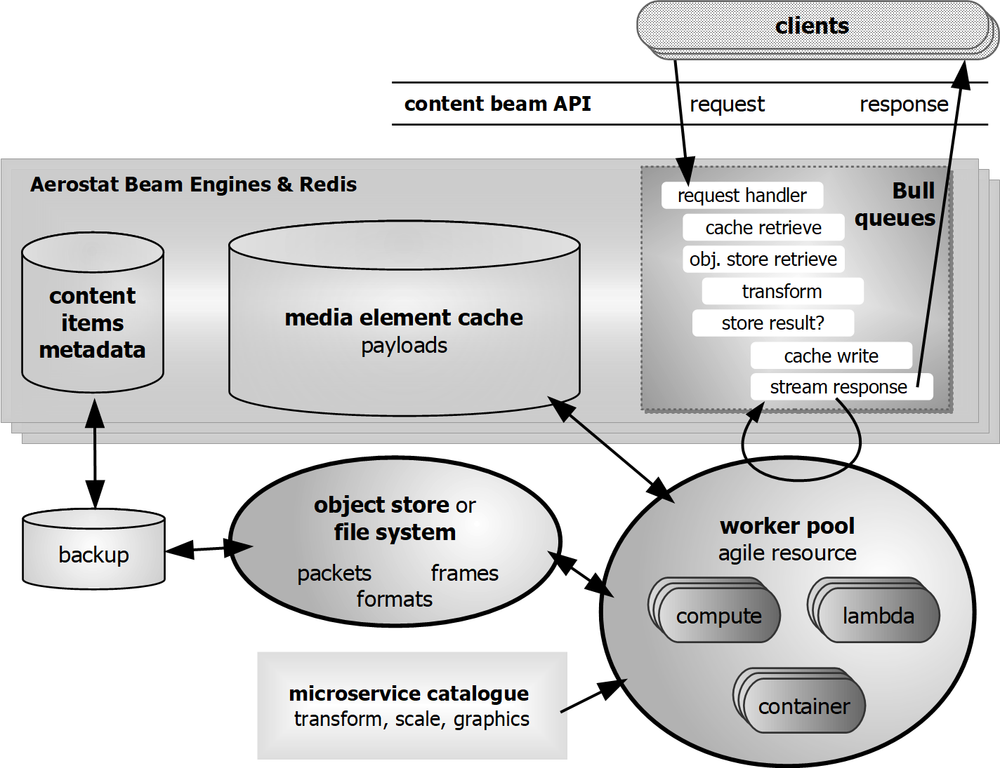

# Aerostat Beam Engine

Redis-backed highly-scale-able and cloud-fit media beam engine. Aerostat Beam Engine provides the following:

* A resilient media-aware cache of media data structured ready for processing by FFmpeg libraries that can be backed by file or object stores;
* Stateless clients providing access to the cache through the _Content Beam API_, an HTTP/S API for transporting media data, pushed and pulled, compressed or uncompressed;
* Job queues allowing multiple worker clients to carry out media transformations just-in-time, on the local systems, distributed across other nodes or via serverless compute like AWS Lambda.

The engine comes in the form of a web server application that provides access to read and write data stored in the underlying Redis cache, which may be a single Redia instance or a cluster of master/slave Redis instances. Also included are some extendible worker clients, supporting clients and the ability to trigger work based on some simple rules.

This is an implementation of the core of the [Agile Media Blueprint](https://www.streampunk.media/agile-media-blueprint).

Work in progress. For Node.js FFmpeg native bindings, please see [Aerostat Beam Coder](https://github.com/Streampunk/beamcoder).

## Installation

## Configuration

Configuration of an Aerostat Beam Engine is achieved by editing the `config.json` file.

## Content Beam API

The _content beam API_ allows FFmpeg-like media data structures to be transported over HTTP and HTTPS protocols. This allows streams of related media - a _virtual format_ or _logical cable_ - to be moved for processing, storage or presentation, either streamed in order or worked on in parallel. Assuming backing by a cache, live streams can be stored and retrieved with little delay - recorded and played back - with a mechanism to start streaming at the latest frame. Endpoints can host the content they represent as _content beams_ through a pull-based mechanism or push media to other endpoints.

All content beam API requests start with `/beams/`. The content beam API for HTTP breaks down as:

`/beams/`&langle;_content_name_&rangle;`/`&langle;_stream_name_&rangle;`/`&langle;_media_ref_&rangle;`/`&langle;_data_ref_&rangle;

* _content_name_: a reference to the source of the content and is set be default to the `url` property of the underlying format context (encoded to safe representation for use in the path part of a URL). This is a unique name for the content that can be beamed from this endpoint.
* _stream_name_: Content is subdivided into streams of _video_, _audio_, _captions_/_subtitles_ and _data_. Streams can be referenced by their index and/or type, e.g. `stream_0`, `stream_1`, ... or aliases `video`, `audio`, `subtitle`, `data` or `attachment` ... or aliases for the first audio stream `audio_0`, the second `audio_1` ... or alias `default` for the stream that FFmpeg considers to be the default stream.
* _media_ref_: The _presentation timestamp_ that uniquely represents a specific media element - _frame_ or _packet_ - or range of media elements in a stream. Most streams have a _time base_ that the presentation time stamps of each element, frame or packet, are measured. Without a _data_ref_, this refers to metadata only.
* _data_ref_: Access to data payloads associated with a single media element, usually simply `data`. For planar data used in some frame formats, `data` refers to the planes concatenated and `data_0`, `data_1` ... refer to each plane.

Content can be created, pulled and pushed, streamed, written, read and deleted using this API. A few examples follow and then the rest of this section breaks down the API in further detail.

To read a single video frame from a compressed stream at timestamp `108000` in content called `newswatch_20190312` for a stream with a time base of 90,000Hz, two GET requests are required:

    https://production.news.zbc.tv/beams/newswatch_20190312/video/108000
    https://production.news.zbc.tv/beams/newswatch_20190312/video/108000/data

The first retrieves the metadata and the second retrieves the associated payload. Here is an example of the retrieved metadata, a JSON document:

```json
{
  "type": "Packet",
  "pts": 108000,
  "dts": 108000,
  "size": 16383,
  "stream_index": 0,
  "flags": {
    "KEY": true,
    "CORRUPT": false,
    "DISCARD": false,
    "TRUSTED": false,
    "DISPOSABLE": false
  },
  "duration": 3600,
  "pos": 18430875
}
```

The second _data_ URL retrieves a payload of type `application/octet-stream` with content length `16383`.

The packet metadata contains no details as to the relative timing of the media element wrt other elements of the stream, the type of data or encoding used. To be able to decode that packet, it is necessary to find out the details of the associated stream. This can be retrieved from a GET request to one of following URLs:

    https://production.news.zbc.tv/beams/newswatch_20190312/video
    https://production.news.zbc.tv/beams/newswatch_20190312/stream_0
    https://production.news.zbc.tv/beams/newswatch_20190312/stream_0.json

The URLs are equivalent and produce the following response:

```json
{
  "type": "Stream",
  "index": 0,
  "id": 301,
  "time_base": [ 1, 9000 ],
  "start_time": 7200,
  "duration": 53666250,
  "r_frame_rate": [ 25, 1 ],
  "codecpar": {
    "type": "CodecParameters",
    "codec_type": "video",
    "codec_id": 173,
    "name": "hevc",
    "format": "yuv420p",
    "width": 1920,
    "height": 1080,
    "color_range": "tv"
  }
}
```

Time can be specified by timestamp, index count, in real time and relatively by offset, including to the _first_ and _latest_ - or _last_ - media element. Metadata can be retrieved using time ranges. Timestamp specification can be _fuzzy_ for the case where errors in timestamp digitisation, fractional framerates or stream jitter mean that timestamps do not increment by an exact, constant value. Here are some examples:

* Single data packet: `/beams/newswatch_20190312/video/packet_108000`
* Uncompressed frame: `/beams/newswatch_live/video/frame_108000`
* Fuzzy match: `/beams/newswatch_live/video/107950f` - also finds 108000
* Range of timestamps: `/beams/newswatch_live/video/108000-144000` (inclusive)
* Range of indexes: `/beams/newswatch_live/video/751st-760th` (1-based from 1st)
* Time range: `/beams/newswatch_live/video/30s-31s` - relative to time base
* To the end: `/beams/newswatch_live/video/1080th-last`
* First frame: `/beams/newswatch_live/video/first`
* Latest frame: `/beams/newswatch_live/video/latest` - redirect to most recent

Finally, these URLs may be decorated by job specifications, such as converting any referenced video frame to a JPEG:

     /beams/newswatch_live/video/frame_108000.jpeg

Another example is creating a partial MP4 file for a specified frame range for all streams:

    /beams/newswatch_live/all/30s-45s.mp4

### Listing available content


### Format - the logical cable


### Streams

### Media elements

### Data

## Relationships

Items of content may be related to other items because they are:

* byte-for-byte _equivalent_, stored in different locations but otherwise with exactly the same encoding, format and other metadata;
* visually equivalent _renditions_, such as some source material and all of the encodings made from it, generally with the same resolution;
* _transformations_ that create a new item of content by applying a filter such as scaling or mixing, possibly with one or more inputs.

These kinds of relationships can be stored in the beamengine to allow a worker to select the most appropriate format or location from which to retrieve source data and/or deliver a result.

### Equivalent

Beam Engine uses Redis as a RAM cache for media data but this cannot be a permanent, medium or long term storage medium. The time-to-live from creation to cache expiry for media data payloads can be set in the config file. When data payloads expire, they are no longer available unless they have also been stored in an external equivalent content item. An equivalent content item is a byte-for-byte copy of the source data. Typically, an equivalent content item will have content name that represents a resolvable storage reference, such as a local file path of AWS S3 bucket identifier, where a version of the cached content was persisted by a worker.

Equivalent content representations are one-to-one relationships. Although there will often be a content source, any equivalent content item should be able to be substituted by another.

Here is an example workflow for a content item being recorded via the Beam Content API.

1. A new content item is created. A file backup worker with access to a shred storage drive responds to all content creation requests by creating an equivalent content items with the same format and streams. An equivalent content relationship is stored in the Beam Engine.

2. Each packet that is stored into the Beam Engine creates a post-response job that stores the packet's metadata and payload onto the shared storage.

3. Requests for the packet's payload that take place prior to the expiry of the packet in the cache are services from the cache.

4. Requests for the packet's payload that occur after the cache expiry cause a `404` error that is intercepted and creates a job. A worker checks to see if any equivalent off-line items of content exists. If so, the packet is retrieved from that storage. By policy, the packet's payload can be re-created in Redis if further requests are expected within the TTL.

As an optimisation, it may be possible to predict that if a particular packet is requested then the next few packets in sequence may be required, so pre-emptive read-ahead jobs can be used to pre-populate the cache for anticipated requests.

__TODO__ - description of asserting a equivalent relationship

### Rendition

As experienced by the viewer, a rendition content item is a visually- and/or audibly-equivalent representation of an item of content. Typically, a rendition has the same resolution its source but may have different parameters such as format or codec, meaning that it is not an exact byte-for-byte copy. Renditions relationships between content items are one-to-one and directional, with a source and a target. A rendition without a source is not a rendition as such and is considered to be the _original_ version.

A rendition has a many-to-many stream mapping within two related content items. For example, a source professional format video file - such as `.mxf` or `.mov` - may have a video stream and sixteen separate mono audio streams. A target rendition has a video stream and a stereo audio stream. The rendition relationship must include which of the source audio streams, say the 3rd and 4th, are used to make the left and right tracks for the target.

One-to-one transformations of a stream that are experientially equivalent may be represented as a rendition, even if the result is a different resolution, number or samples or number of packets. For example:

* scaling a video stream for presentation on a lower resolution device, as this is a form of compression;
* similarly, reducing the sample rate of high-definition audio;
* compressing audio and adding a short amount of additional silence at the beginning or end to facilitate better lip sync.

Decode rendition relationships have source media elements that are packets and target media elements that are frames, whereas encode rendition relationships start with frames and end up with packets. A rendition target may be a lossless rendition of its source, such as a different packing of samples into a transport. For example, an interleaved V210 packing of an uncompressed 10-bit-per-sample video packet that is otherwise represented as 16-bits-per-sample as separate planes as a frame.

In a workflow, a rendition relationship can be used as follows:

1. Create a new item of content and a rendition relationship to its source. The format of the content items declares details of the target transformation from the source. The relationship includes any stream mappings from source to target and may suggest how the data payloads are to be made.

2. The media element metadata and payloads of a rendition can be made in one of three ways:
   * _provided_: the payloads are sent in over the Content Beam API in the usual way.
   * _just-in-case_: payloads are made be a worker or workers from the source material as soon as possible.
   * _just-in-time_: payloads are made as requested and, where appropriate, cached for subsequent requests.

3. If a request is made for rendition media element metadata payload that does not exist, a worker can be assigned to determine whether to respond with `404 - Not Found` or to assign another worker to make the response _just-in-time_.

__TODO__ - description of asserting a rendition relationship

### Transformation

A content item that is made by applying a filter to one or more other content items such as what a viewer experiences is different from the source is a form of transformation. Transformations include cropping, scaling, mixing, graphics, shaping, retiming (e.g. slow motion), filtering (e.g. remove noise) etc.. A transformation relationship is a means of specifying the correspondence between items of source material that are transformed to make items of target material.

Transformation relationships may be time bounded and only exist for part of the target's timeline. This is a bit like a combination of the timeline in an editor and a live vision mixer:

* For timelines, recipes can be specified in advance.
* For live streams, parameters such as mix level or graphics position can be updated on-the-fly.
* Or you can have a mix of the two, with recipes triggered by live events and/or recipes configuring potential live interaction.

At a content-item level, transformations are typically one-to-many, a target with one or more sources. However, in some cases, a transformation may create more than one target, for example making separate key and fill versions of video with graphics overlay. At a stream level, relationships may be many-to-many and exists between media elements that are frames rather than packets.

As with rendition relationships, transformation relationships can be externally _provided_, made _just-in-case_ or made _just-in-time_.

__TODO__ - description of asserting a transformation relationship

## Workers

Workers run jobs, either just-in-time to create a response to an HTTP request or triggered to do some just-in-vase background work - e.g. housekeeping - as the result of a request. For example:

* create an image from a frame of video _on-the-fly_;
* change the sample rate of some audio as it is being played without storing the result, e.g. 44,100Hz to 48,000Hz;
* store an equivalent representation of some media into an object store or onto a filing system.



Workers can run in the same application and on the same system as a Beam Engine. However, the design idea behind the beam engine is that work is distributed across many systems and processors, with the front end is scaled by having multiple instances of Beam Engines with a common data source. Redis is the data source glue in the middle, ensuring that jobs are queued and executed to order using [Bull](https://www.npmjs.com/package/bull).

A Beam Engine is configured with _rules_ that determine what jobs are scheduled and when depending on beam engine requests, classifying the work to different queues. Workers service queues, executing jobs using the shared Redis as both the job manager and primary access point for data payloads. A worker is taken from a catalogue of microservices, may service one or more queues and can be implemented as:

* A single-threaded Node.js process that can execute one job at a time;
* A [Node.js cluster](https://nodejs.org/docs/latest-v10.x/api/cluster.html) that can execute a number of concurrent _workers_;
* GPU-accelerated processing, facilitated by a library such as [NodenCL](https://github.com/Streampunk/nodencl);
* An invocation of an external processing function, such as an [AWS Lambda](https://aws.amazon.com/lambda/) function - see also [Aerostat Beam Lambda](https://www.npmjs.com/package/beamlambda).


### Setting up a rule

### Pre-built workers

### Writing a worker

## Status, support and further development

Although the architecture of the aerostat beam engine is such that it could be used at scale in production environments, development is not yet complete. In its current state, it is recommended that this software is used in development environments and for building prototypes. Future development will make this more appropriate for production use.

Contributions can be made via pull requests and will be considered by the author on their merits. Enhancement requests and bug reports should be raised as github issues. For support, please contact [Streampunk Media](http://www.streampunk.media/).

## License

This project is licensed under the GNU General Public License, version 3 or later. Copyright (C) 2019, Streampunk Media Ltd.

This software links to libraries from the FFmpeg project, including optional parts and optimizations covered by the GPL v2.0 or later. Your attention is drawn to the FFmpeg project's page [FFmpeg License and Legal Considerations](https://www.ffmpeg.org/legal.html).
